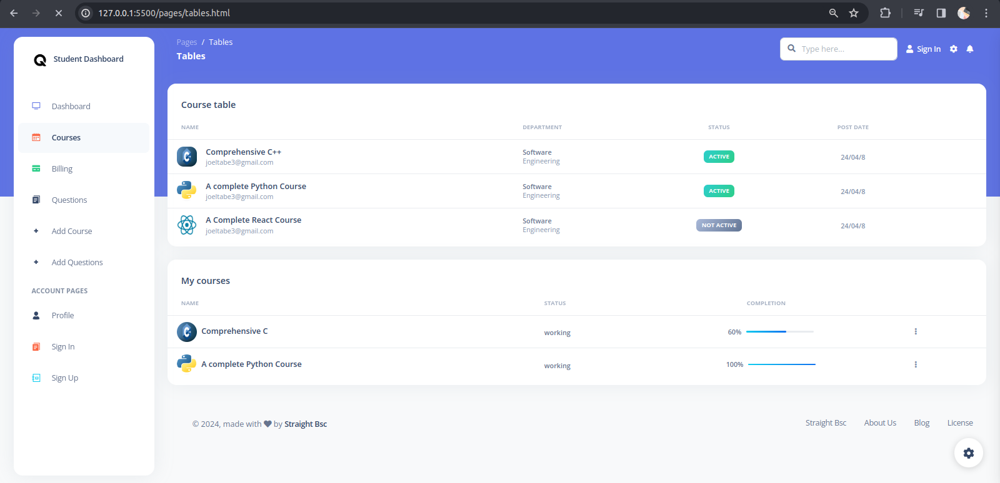

# Quizzy Learning Management System

Quizzy is a learning management system designed for educational institutions to manage courses, quizzes, and user accounts. It is a group project developed by Level 300 students of Landmark Metropolitan University.

 [](https://github.com/creativetimofficial/argon-dashboard/issues?q=is%3Aopen+is%3Aissue) [](https://github.com/creativetimofficial/argon-dashboard/issues?q=is%3Aissue+is%3Aclosed)


## Screenshots





## Technologies Used

- HTML
- CSS
- JavaScript

## Authors

- Straight B.Tech Level 300 Students of Landmark Metropolitan University

## Features

- User registration and authentication
- Course management (creation, update, deletion)
- Quiz creation and management
- User profile management
- Video management
- Question paper management
- Department and school management

## Installation

To run Quizzy locally, follow these steps:

1. Clone the repository:

```bash
git clone https://github.com/Joeltabe/quizzy-dashboard.git
```

2. Navigate to the project directory:

```bash
cd Quizzy
```

3. Open `index.html` in your web browser.

## Contributing

If you would like to contribute to Quizzy, please follow these steps:

1. Fork the repository.
2. Create a new branch for your feature: `git checkout -b main`.
3. Make your changes and commit them: `git commit -m 'Add some feature'`.
4. Push to the branch: `git push origin main`.
5. Submit a pull request.

## License

This project is licensed under the [MIT License](LICENSE).